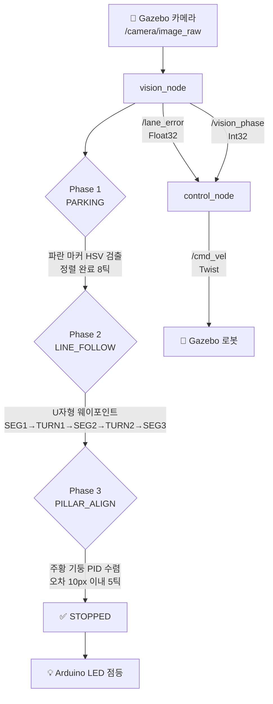

# 🚗 AutoWash EasyAlign Bot
### — 자동세차장 차량 정렬 이지봇 —

**ROS2 + OpenCV 기반 자동세차장 차량 정렬 유도 시스템**  


---

## 💡 프로젝트 배경

자동세차장 입구의 좁은 레일에 타이어를 정확히 맞추는 일은 생각보다 쉽지 않습니다.  
뒤에 차들이 줄지어 기다리는 상황에서 반복적으로 위치를 조정하다 보면 운전 미숙으로 인한 진입 실패가 빈번하게 발생합니다.

본 프로젝트는 **현대자동차그룹의 AI 주차 로봇(Parking Robot)** 에서 착안하였습니다.  
카메라 비전으로 정차 마커 → 레인 추종 → 기둥 정렬까지 3단계 자율 주행을 Gazebo 시뮬레이션 환경에서 구현합니다.

---

## 🖥 개발 환경

| 구분 | 내용 |
|------|------|
| **호스트 머신** | MacBook Pro M2 (macOS) |
| **VM** | VMware Fusion 13 + Ubuntu 24.04 (Noble) |
| **ROS 버전** | ROS2 Jazzy |
| **Gazebo 버전** | Gazebo Sim 8.11.0 |
| **OpenCV 버전** | 4.6.0 |
| **Python 버전** | 3.12.3 |
| **영상 입력** | Gazebo 가상 카메라 (`/camera/image_raw` 토픽) |
| **편집기** | VS Code + Claude Code |

> ⚠️ VMware Fusion → Settings → Display → **"Accelerate 3D Graphics"** 활성화 필요  
> 소프트웨어 렌더링 환경변수: `LIBGL_ALWAYS_SOFTWARE=1 MESA_GL_VERSION_OVERRIDE=4.5`

---

## 🛠 기술 스택

| Category | Technology |
|----------|------------|
| Robotics | ROS2 Jazzy, Gazebo Sim 8.11 |
| Vision | OpenCV 4.6 (HSV 필터링, findContours), cv_bridge |
| Bridge | ros_gz_bridge (Gazebo ↔ ROS2 토픽 연결) |
| Hardware | Arduino (LED 피드백, Day 4 예정) |
| Language | Python 3.12 |
| Infra | VMware Fusion 13, Ubuntu 24.04, VS Code |

---

## 📁 프로젝트 구조

```
src/Mini_Project/src/parking_vision/
├── parking_vision/
│   ├── vision_node.py      # 3단계 비전 상태머신 (마커/레인/기둥 검출)
│   └── control_node.py     # PID 제어 + U자형 경로 웨이포인트 시퀀스
├── simulation/
│   ├── worlds/
│   │   └── carwash.world   # Gazebo 세차장 가상 환경 (U자형 도로)
│   └── models/
│       └── carwash_pillar/ # 기둥 모델
├── launch/
│   └── carwash.launch.py   # 전체 시스템 실행 launch 파일
├── package.xml
├── setup.py
└── README.md
```

---

## 🗺 시뮬레이션 세계 레이아웃

```
(시작) x=-4, y=0.5
   ↓
파란 정차 마커 x=-3
   ↓ [Phase 1 완료]
─────────── SEG1: 동진 ──────────→  코너1 (x=2, y=0)
                                          ↓  TURN1: 우회전
                                     SEG2: 남진
                                          ↓  TURN2: 우회전
세차장 입구 (x=0, y=-3) ←── SEG3: 서진 ──
   ↓ [Phase 3]
주황 기둥 사이 정렬 완료 ✅
```

- **도로**: 3개 구간 + 흰색 레인 마킹 + 연석(curb)
- **건물**: 세차장 북벽/남벽/후벽/지붕/캐노피
- **기둥**: `pillar_north` (y=-2.2) · `pillar_south` (y=-3.8) + 상단 크로스바

---

## 🧠 3단계 자율주행 파이프라인



---

## 🔍 Phase별 핵심 Vision 로직

### Phase 1 — 파란 정차 마커 감지
```
HSV 범위: H:100-130, S:80-255, V:60-255
→ 마커 중심 오차 계산 → aligned_count >= 8 틱 → Phase 2 전환
```

### Phase 2 — 흰색 레인 추종 + U자형 경로
```
하단 40% ROI → HSV (H:0-180, S:0-35, V:200-255) 흰색 검출
→ 최대 윤곽 중심 오차 → control_node 타이밍 웨이포인트로 코너 처리
  SEG1(380틱) → TURN1(22틱) → SEG2(200틱) → TURN2(22틱) → SEG3
→ 주황 기둥 800px 이상 감지 시 Phase 3 전환
```

### Phase 3 — 주황 기둥 PID 정렬
```
HSV 범위: H:5-35, S:100-255, V:80-255 (소프트웨어 렌더링 보정)
면적 100px 이상, h > w×0.3 조건
→ 좌/우 기둥 평균 중심 오차 → PID 수렴 → error < 10px × 5틱 → STOPPED
폴백: 기둥 미감지 5초 → STOPPED (기둥 사이 진입으로 간주)
```

---

## ⚙ PID 파라미터

| 게인 | 값 | 역할 |
|------|-----|------|
| Kp | 0.005 | 현재 오차 비례 |
| Ki | 0.0001 | 누적 오차 보정 |
| Kd | 0.002 | 오차 변화율 감쇠 |
| 적분 클램프 | ±80 | Windup 방지 |

---

## 🔄 360도 바퀴 (메카넘/옴니 휠) 개념

현대 자동차의 360도 이동 기술에서 착안하여, 횡이동 기반 정렬 업그레이드 포인트를 코드에 명시했습니다.

| Phase | 현재 방식 | 메카넘 업그레이드 시 |
|-------|-----------|---------------------|
| Phase 1 (PARKING) | angular.z 회전으로 정렬 | `linear.y`로 옆으로 슬라이딩 정렬 |
| Phase 3 (PILLAR_ALIGN) | angular.z PID 조향 | `linear.y`로 직접 횡이동 정렬 |

```python
# 현재 (DiffDrive): angular.z = -steering
# 메카넘 활성화 시: twist.linear.y = -lateral_error * Kp_lateral
```

> DiffDrive 플러그인은 `linear.y` 무시 → 메카넘 전환 시 `gz-sim8-mecanum-drive-system` 플러그인으로 교체 필요

---

## 📅 개발 일정 (매주 금요일)

| 회차 | 날짜 | 주제 | 결과물 |
|------|------|------|--------|
| ✅ Day 1 | 04.24 | 환경 설정 | Docker + Gazebo + ROS2 개발환경 완성 |
| ✅ Day 2 | 05.08 | Vision Pipeline + Gazebo 통합 | 기둥 검출 · PID 제어 · 파이프라인 전체 연결 |
| ✅ Day 3 | 05.15 | 3단계 자율주행 + U자형 세계 | Phase 1→2→3→STOPPED 전체 동작 확인 |
| ⬜ Day 4 | 05.22 | 통합 + 마무리 | Arduino LED · 데모 영상 · 포트폴리오 |

---

## ▶️ 실행 방법

### 1. 빌드
```bash
cd ~/ros2_ws
source /opt/ros/jazzy/setup.bash
colcon build --packages-select parking_vision
source install/setup.bash
```

### 2. 전체 시스템 실행 (권장)
```bash
# 이전 프로세스 정리
ps aux | grep -E "vision|control|gz|ros2" | grep -v grep | awk '{print $2}' | xargs -r kill -9

# 실행 (소프트웨어 렌더링)
LIBGL_ALWAYS_SOFTWARE=1 MESA_GL_VERSION_OVERRIDE=4.5 \
  ros2 launch parking_vision carwash.launch.py
```

### 3. 노드 개별 실행 (테스트용)
```bash
# 터미널 1
ros2 run parking_vision vision_node

# 터미널 2
ros2 run parking_vision control_node
```

---

## 💡 핵심 기능 요약

- **3단계 상태머신** — 정차 마커 감지 → 레인 추종 → 기둥 정렬 자동 전환
- **U자형 경로 주행** — 타이밍 기반 웨이포인트(SEG1→TURN1→SEG2→TURN2→SEG3)로 코너 정복
- **HSV 색상 비전** — 파란 마커·흰 레인·주황 기둥 각각 별도 HSV 범위로 검출
- **PID 제어** — Kp/Ki/Kd + 적분 클램프(±80)로 부드러운 수렴
- **이중 카메라** — 로봇 1인칭 + 오버헤드 탑뷰 합성 모니터링
- **360도 바퀴 개념** — 메카넘 횡이동 업그레이드 포인트 코드 내 명시

---

## 👤 Developer

- **과정**: K-Digital 스마트 모빌리티 자율주행 부트캠프
- **학교**: 연희직업학교
- **GitHub**: https://github.com/jinnnih/Mini_Project
