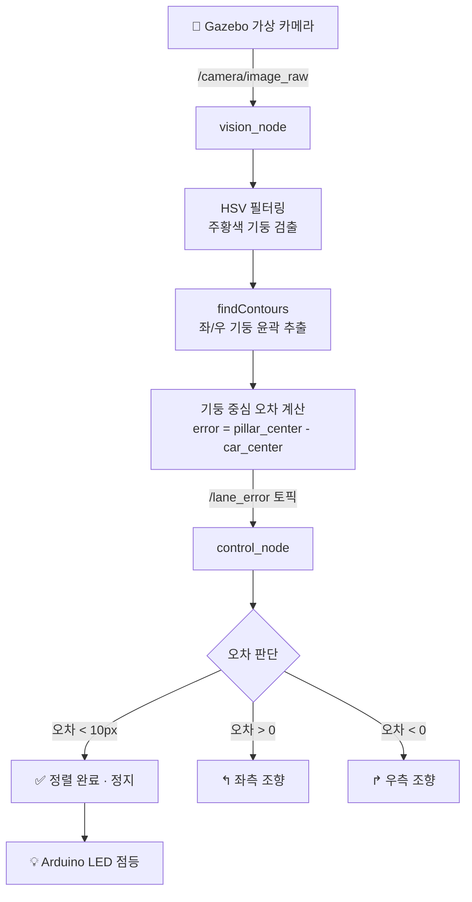

# 🚗 AutoWash EasyAlign Bot
### — 자동세차장 차량 정렬 이지봇 —

**ROS2 + OpenCV 기반 자동세차장 차량 정렬 유도 시스템**  


---

## 💡 프로젝트 배경

자동세차장 입구의 좁은 레일에 타이어를 정확히 맞추는 일은 생각보다 쉽지 않습니다.  
뒤에 차들이 줄지어 기다리는 상황에서 반복적으로 위치를 조정하다 보면 운전 미숙으로 인한 진입 실패가 빈번하게 발생합니다.

본 프로젝트는 **현대자동차그룹의 AI 주차 로봇(Parking Robot)** 에서 착안하였습니다.  
차량 하부로 진입한 로봇이 차를 정확한 위치로 이동시키는 개념을 응용하여,  
카메라 비전으로 세차장 입구 기둥을 실시간 인식하고 **로봇이 차량을 정중앙으로 정렬시킨 후 정지**하는 시스템을 Gazebo 시뮬레이션 환경에서 구현합니다.

---

## 🖥 개발 환경

| 구분 | 내용 |
|------|------|
| **호스트 머신** | MacBook Pro M2 (macOS) |
| **컨테이너** | Docker (`ros:jazzy` 이미지) |
| **ROS 버전** | ROS2 Jazzy |
| **Gazebo 버전** | Gazebo Sim 8.11.0 |
| **OpenCV 버전** | 4.6.0 |
| **Python 버전** | 3.12.3 |
| **영상 입력** | Gazebo 가상 카메라 (`/camera/image_raw` 토픽) |
| **편집기** | VS Code (Dev Containers 익스텐션) |

> ⚠️ M2 Mac 환경 특이사항: ARM64 아키텍처로 인해 Docker 기반 개발환경 채택.  
> Ubuntu 24.04 (Noble) VM 환경으로 전환 예정 (Day 3~4).

---

## 🛠 기술 스택

| Category | Technology |
|----------|------------|
| Robotics | ROS2 Jazzy, Gazebo Sim 8.11 |
| Vision | OpenCV 4.6 (HSV 필터링, findContours) |
| Hardware | Arduino (LED 피드백) |
| Language | Python 3.12 |
| Infra | Docker (`ros:jazzy`), VS Code Dev Containers |

---

## 📁 프로젝트 구조

```
.
├── parking_vision/
│   ├── __init__.py
│   ├── vision_node.py      # 기둥 검출 + 오차 계산 → ROS2 퍼블리시
│   └── control_node.py     # PID 제어 + 정렬 판단 로직
├── simulation/
│   ├── worlds/
│   │   └── carwash.world   # Gazebo 세차장 가상 환경
│   └── models/
│       └── carwash_pillar/ # 기둥 + 차량 모델
├── launch/
│   └── carwash.launch.py   # 전체 시스템 실행 launch 파일
├── arduino/                # Arduino LED 피드백 (Day 4)
├── package.xml
├── setup.py
└── README.md
```

---

## 🧠 시스템 파이프라인



---

## 🔍 핵심 Vision 로직

기둥 검출은 전통적인 OpenCV 기법으로 구현했습니다.

```
1. BGR → HSV 색공간 변환
2. 주황색 기둥 HSV 범위 필터링 (H:10~20, S:200~255, V:200~255)
3. findContours로 기둥 윤곽선 추출
4. 면적(500px↑) + 세로 비율(h > w×1.5) 조건으로 기둥 판별
5. 좌/우 기둥 중심 X좌표 평균 → 기둥 중앙 계산
6. 오차 = 기둥 중앙 - 화면 중앙
```

> 실제 적외선 카메라 대신 OpenCV 색상/윤곽선 검출로 동등한 효과를 구현했습니다.

---

## 📅 개발 일정 (매주 금요일)

| 회차 | 날짜 | 주제 | 주요 작업 | 결과물 |
|------|------|------|-----------|--------|
| ✅ Day 1 | 04.24 (금) | 환경 설정 | Docker ros:jazzy 컨테이너 구축, Gazebo 8.11 설치, VS Code Dev Containers 세팅 | 개발환경 구축 완료 |
| ✅ Day 2 | 05.08 (금) | Vision Pipeline | HSV 기둥 검출, findContours, 오차 계산, ROS2 토픽 퍼블리시, PID 제어, Gazebo 세차장 월드 작성 | 기둥 검출 영상 + 오차값 출력 + 두 노드 통신 확인 |
| ⬜ Day 3 | 05.15 (금) | ROS2 + Gazebo 통합 | Ubuntu 24.04 환경 전환, vision_node ↔ control_node ↔ Gazebo 차량 연결 | Gazebo 차량 정렬 시뮬레이션 |
| ⬜ Day 4 | 05.22 (금) | 통합 + 마무리 | Arduino LED 연동, 시스템 통합 테스트 | 데모 영상 + 포트폴리오 완성 |

---

## 💡 핵심 기능

- **Pillar Detection** — HSV 필터 + findContours로 세차장 입구 기둥 실시간 검출
- **Precise Alignment** — 픽셀 기반 오차 계산으로 정밀 정렬 (오차 10px 이내 자동 정지)
- **PID Control** — 부드러운 조향을 위한 PID 제어 (지그재그 없이 수렴)
- **Hardware Feedback** — Arduino LED로 정렬 상태 실시간 표시
- **Full Simulation** — Gazebo 가상환경에서 실제 로봇 없이 검증

---

## ▶️ 실행 방법

### 0. 사전 준비
```bash
# Docker 컨테이너 시작
docker start ros2_jazzy
docker exec -it ros2_jazzy bash
```

### 1. 환경 설정
```bash
source /opt/ros/jazzy/setup.bash
source ~/ros2_ws/install/setup.bash
```

### 2. 패키지 빌드
```bash
cd ~/ros2_ws
colcon build --packages-select parking_vision
```

### 3. Vision Node 실행
```bash
ros2 run parking_vision vision_node
```

### 4. Control Node 실행 (새 터미널)
```bash
docker exec -it ros2_jazzy bash
source /opt/ros/jazzy/setup.bash
source ~/ros2_ws/install/setup.bash
ros2 run parking_vision control_node
```

### 5. 전체 시스템 launch (Day 3 이후)
```bash
ros2 launch parking_vision carwash.launch.py
```

---

## ✨ Optional (시간 여유 시)

- YOLO 모델 적용 (기둥 외 다양한 객체 인식)
- Flask 웹 대시보드 (정렬 상태 모니터링)
- 일본어 UI (전공 활용)

---

## 👤 Developer

- **과정**: K-Digital 스마트 모빌리티 자율주행 부트캠프
- **학교**: 연희직업학교
- **GitHub**: https://github.com/jinnnih/Mini_Project
