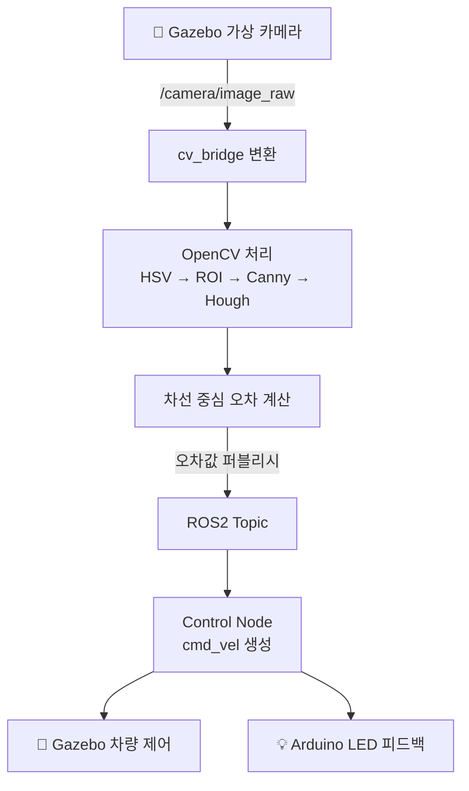

# 🚗 Vision-Guided Parking & Carwash Alignment System

**ROS2 + OpenCV 기반 차량 정렬 유도 시스템**  
K-Digital 스마트 모빌리티 자율주행 부트캠프 — 연희직업학교


---

## 🖥 개발 환경

| 구분 | 내용 |
|------|------|
| **호스트 머신** | MacBook Pro M2 (macOS) |
| **가상화** | VMware Fusion → Ubuntu 22.04 LTS |
| **ROS 실행** | Docker 컨테이너 (ROS2 버전 충돌로 Docker 채택) |
| **ROS 버전** | ROS2 Humble |
| **시뮬레이터** | Gazebo Classic |
| **영상 입력** | Gazebo 가상 카메라 (`/camera/image_raw` 토픽) |
| **편집기** | VS Code (Mac + Ubuntu 양쪽 사용) |

> ⚠️ M2 Mac 환경 특이사항: 웹캠의 VMware/Docker 전달이 불안정하여 Gazebo 가상 카메라를 영상 입력 소스로 채택

---

## 🛠 기술 스택

| Category | Technology |
|----------|------------|
| Robotics | ROS2 Humble, Gazebo Classic |
| Vision | OpenCV, Roboflow |
| Hardware | Arduino (LED 피드백) |
| Language | Python, C++ |
| Infra | Docker, VMware, Ubuntu 22.04 |

---

## 📁 프로젝트 구조

```
.
├── scripts/
│   ├── vision_node.py     # OpenCV 차선 검출 + 오차 계산 → ROS2 퍼블리시
│   └── control_node.py    # 오차 기반 cmd_vel 제어 + 정렬 판단 로직
├── simulation/            # Gazebo 월드 파일, 카메라 설정
├── arduino/               # Arduino: 정렬 상태별 LED 피드백
└── README.md
```

---

## 🧠 시스템 파이프라인



---

## 📅 개발 일정 (매주 금요일)

| 회차 | 날짜 | 주제 | 주요 작업 | 결과물 |
|------|------|------|-----------|--------|
| ✅ Day 1 | 04.24 (금) | 환경 설정 | VMware Ubuntu 설치, ROS2 충돌 → Docker 전환 | 개발환경 구축 완료 |
| 👉 Day 2 | 05.08 (금) | Vision Pipeline | HSV + Canny + Hough 차선 검출, 오차 계산 | 차선 검출 영상 + 오차값 출력 |
| ⬜ Day 3 | 05.15 (금) | ROS2 + Gazebo 통합 | vision_node ↔ control_node, cmd_vel 제어 | Gazebo 차량 정렬 시뮬레이션 |
| ⬜ Day 4 | 05.22 (금) | 통합 + 마무리 | Arduino LED 연동, 시스템 통합 테스트 | 데모 영상 + 포트폴리오 완성 |

---

## 💡 핵심 기능

- **Precise Alignment** — 픽셀 기반 차선 중심 오차 계산으로 정밀 정렬
- **Dual Mode** — 주차장 / 세차장 모드 전환 지원
- **Hybrid Vision** — OpenCV 전통 기법 + Roboflow AI 데이터 활용
- **Hardware Feedback** — Arduino LED로 정렬 상태 실시간 표시
- **Full Simulation** — Gazebo 가상환경에서 실제 로봇 없이 검증

---

## ▶️ 실행 방법

> 🔧 **프로젝트 완성 후 실제 명령어로 업데이트 예정 (Day 4 마감 기준)**

### 1. Docker 컨테이너 실행
```bash
# TODO: 실제 컨테이너명으로 교체
docker run -it --rm \
  -e DISPLAY=$DISPLAY \
  -v /tmp/.X11-unix:/tmp/.X11-unix \
  ros2_humble_container
```

### 2. Gazebo 시뮬레이션 실행
```bash
# TODO: launch 파일명 확정 후 업데이트
ros2 launch simulation parking_world.launch.py
```

### 3. Vision 노드 실행
```bash
ros2 run parking_alignment vision_node
```

### 4. Control 노드 실행
```bash
ros2 run parking_alignment control_node
```

---

## ✨ Optional (시간 여유 시)

- YOLO 모델 적용
- Flask 웹 대시보드
- 일본어 UI (전공 활용)

---

## 👤 Developer

- **과정** : K-Digital 스마트 모빌리티 자율주행 부트캠프
- **학교** : 연희직업학교
